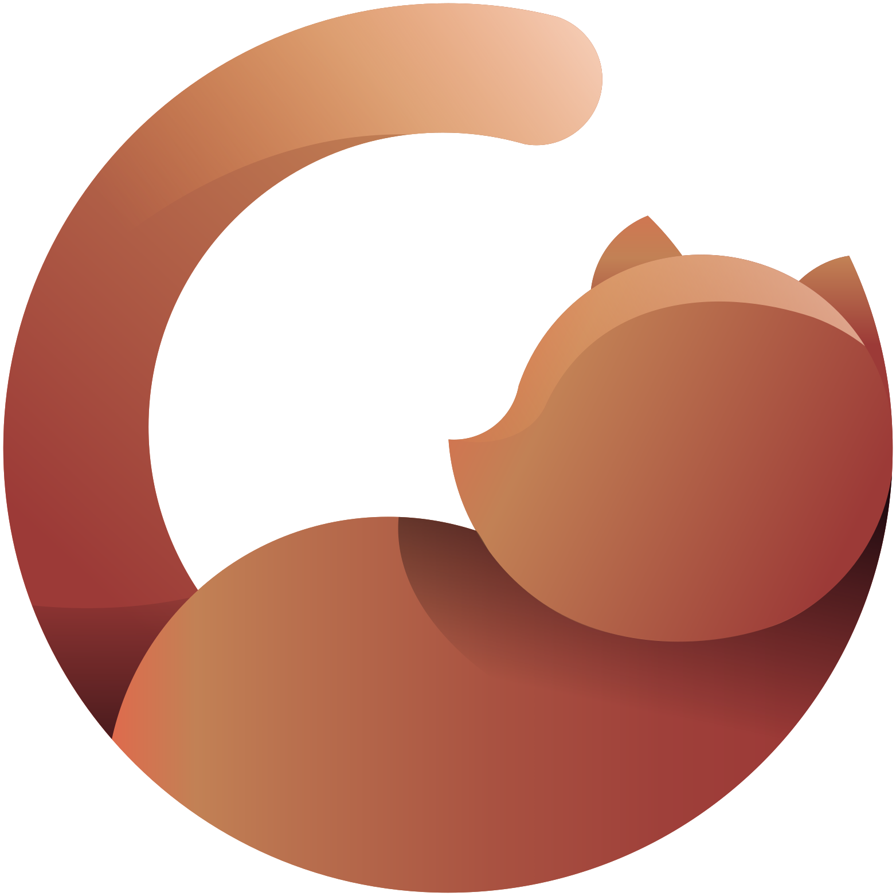
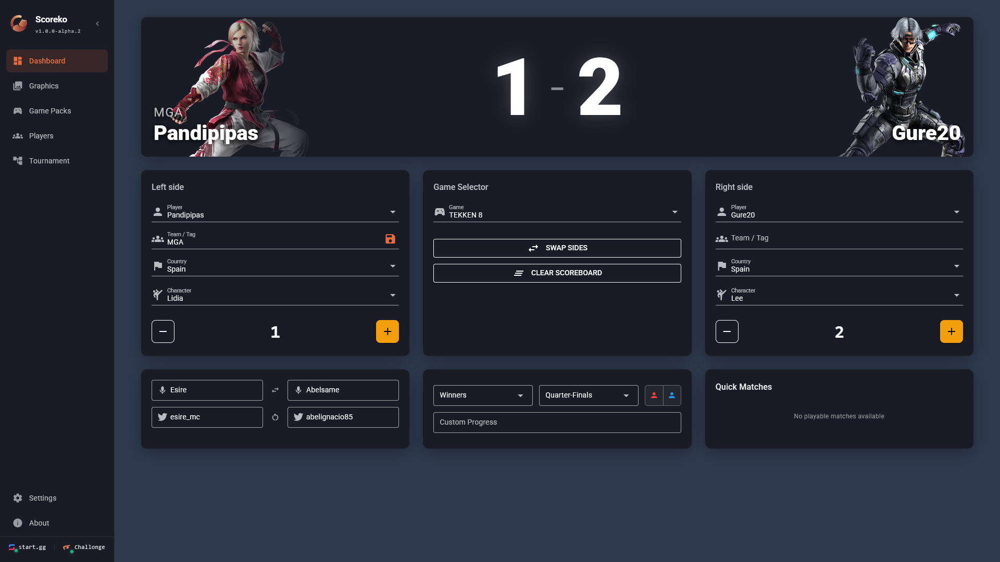
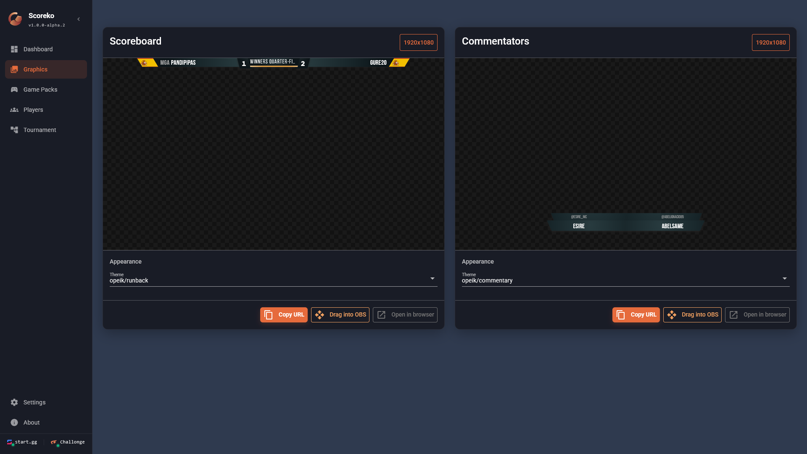
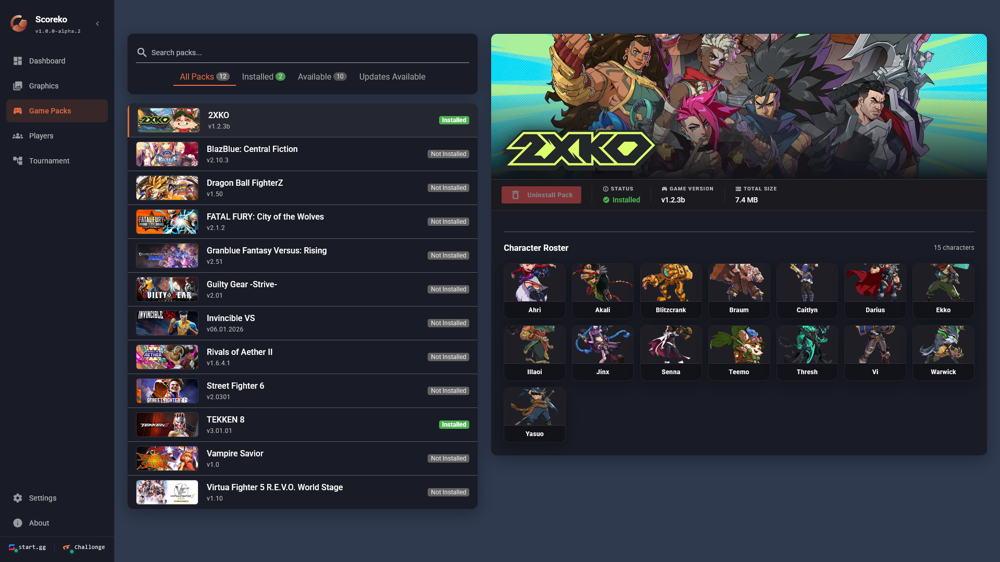
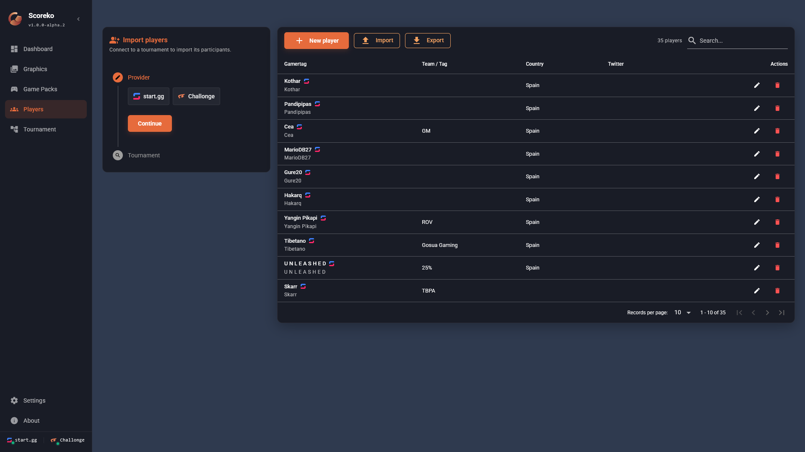
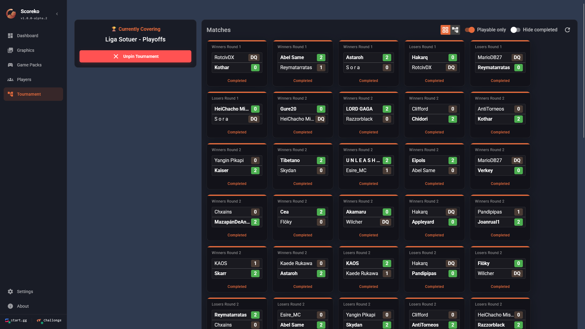
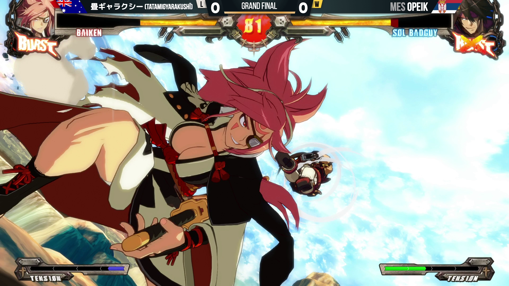

<a id="readme-top"></a>


<!--
*** Thanks for checking out the Best-README-Template. If you have a suggestion
*** that would make this better, please fork the repo and create a pull request
*** or simply open an issue with the tag "enhancement".
*** Don't forget to give the project a star!
*** Thanks again! Now go create something AMAZING! :D
-->


<!-- PROJECT SHIELDS -->
[![Contributors][contributors-shield]][contributors-url]
[![Forks][forks-shield]][forks-url]
[![Stargazers][stars-shield]][stars-url]
[![Issues][issues-shield]][issues-url]
[![GPL-3.0 License][license-shield]][license-url]


<!-- PROJECT LOGO -->
<br />
<div align="center">
  <a href="https://github.com/Pandipipas/scoreko">
    
  </a>

<h3 align="center">Scoreko</h3>

  <p align="center">
    NodeCG bundle for fighting games broadcast graphics
    <br />
    <a href="https://github.com/Pandipipas/scoreko/releases/latest"><strong>Download</strong></a>
    &middot;
    <a href="https://github.com/Pandipipas/scoreko">Explore the docs »</a>
    <br />
    <br />
    <a href="https://github.com/Pandipipas/scoreko/issues/new?labels=bug&template=bug-report---.md">Report Bug</a>
    &middot;
    <a href="https://github.com/Pandipipas/scoreko/issues/new?labels=enhancement&template=feature-request---.md">Request Feature</a>
  </p>
</div>


<!-- TABLE OF CONTENTS -->
<details>
  <summary>Table of Contents</summary>
  <ol>
    <li>
      <a href="#about-the-project">About The Project</a>
      <ul>
        <li><a href="#interface-showcase">Interface Showcase</a></li>
        <li><a href="#built-with">Built With</a></li>
      </ul>
    </li>
    <li>
      <a href="#getting-started">Getting Started</a>
      <ul>
        <li><a href="#standalone-version-recommended">Standalone Version</a></li>
        <li><a href="#building-from-source">Building from Source</a></li>
      </ul>
    </li>
    <li><a href="#usage">Usage</a></li>
    <li><a href="#roadmap">Roadmap</a></li>
    <li><a href="#contributing">Contributing</a></li>
    <li><a href="#license">License</a></li>
    <li><a href="#contact">Contact</a></li>
  </ol>
</details>


<!-- ABOUT THE PROJECT -->
## About The Project

Scoreko is a NodeCG bundle for fighting game broadcasts.

Features include:

- Scoreboard and commentator overlays
- **start.gg** and **challonge** integration for fetching brackets and players
- Dynamic game asset packs downloading via remote repositories
- Multi-language dashboard support (English and Spanish)
- **Standalone executable (`.exe`) wrapper** with Electron for non-developers

### Interface Showcase

<details open>
  <summary><b>Dashboard</b></summary>
  <br />
  
</details>

<details>
  <summary><b>Graphics</b></summary>
  <br />
  
</details>

<details>
  <summary><b>Game Packs</b></summary>
  <br />
  
</details>

<details>
  <summary><b>Players</b></summary>
  <br />
  
</details>

<details>
  <summary><b>Tournament</b></summary>
  <br />
  
</details>

<details>
  <summary><b>Scoreboard Overlay</b></summary>
  <br />
  
</details>

<p align="right">(<a href="#readme-top">back to top</a>)</p>


### Built With

* [![Vue][Vue.js]][Vue-url]
* [![Vite][Vite.js]][Vite-url]
* [![TypeScript][TypeScript]][TypeScript-url]
* [![Quasar][Quasar.dev]][Quasar-url]
* [![NodeCG][NodeCG.dev]][NodeCG-url]
* [![Electron][Electron.js]][Electron-url]

<p align="right">(<a href="#readme-top">back to top</a>)</p>


<!-- GETTING STARTED -->
## Getting Started

You can run Scoreko using the standalone executable (easiest method) or build it from source.

### Standalone Version (Recommended)

For non-developers and those looking for a quick setup, Scoreko offers a standalone executable wrapped in Electron.

1. Download the latest `.exe` from the [Releases page](https://github.com/Pandipipas/scoreko/releases/latest)
2. Run the executable. The NodeCG server and dashboard will automatically start and open in an Electron window.

### Building from Source

If you want to modify the source code or run it manually via Node.js:

#### Prerequisites

* Node.js and npm
* Git

#### Installation

1. Clone the repo:
   ```sh
   git clone https://github.com/Pandipipas/scoreko.git
   ```
2. Install NPM packages:
   ```sh
   cd scoreko
   npm ci
   ```
3. Build the project:
   ```sh
   npm run build
   ```
4. Start NodeCG:
   ```sh
   npx nodecg start
   ```

<p align="right">(<a href="#readme-top">back to top</a>)</p>


<!-- USAGE EXAMPLES -->
## Usage

Once the server is running (either via the `.exe` or via source), access the dashboard to control the overlays. If using the source version, open `http://localhost:9090`.

### Importing overlays into OBS

Scoreko includes a built-in system to easily import your overlays:
- Open the **Graphics** tab in the Scoreko dashboard.
- **Drag and Drop**: Click and drag from the provided button directly into OBS to automatically create the Browser Source.
- **Copy URL**: Alternatively, you can copy the URL and create a new Browser Source in OBS manually.

When configuring the Browser Source in OBS, ensure you set:
- **Width** to `1920` and **Height** to `1080`
- **FPS** to `60`
- Check **"Shutdown source when not visible"**
- Check **"Refresh browser when scene becomes active"**

### Themes

Scoreko includes the default `opeik/runback` theme for the scoreboard and `opeik/commentary` for commentary overlays, with built-in infrastructure in the Graphics tab to switch and support additional custom themes.

<p align="right">(<a href="#readme-top">back to top</a>)</p>


<!-- TROUBLESHOOTING -->
## Troubleshooting

### Slow Startup / First Boot

If you are using the Standalone Version and the application takes a long time to start on the very first boot, this is completely normal. Scoreko extracts thousands of files for its internal environment, and some Antivirus software (such as Windows Defender) scans each file individually during extraction. Subsequent launches will be much faster.

<p align="right">(<a href="#readme-top">back to top</a>)</p>


<!-- ROADMAP -->
## Roadmap

See the [open issues](https://github.com/Pandipipas/scoreko/issues) for a full list of proposed features (and known issues).

<p align="right">(<a href="#readme-top">back to top</a>)</p>


<!-- CONTRIBUTING -->
## Contributing

Contributions are what make the open source community such an amazing place to learn, inspire, and create. Any contributions you make are **greatly appreciated**.

If you have a suggestion that would make this better, please fork the repo and create a pull request. You can also simply open an issue with the tag "enhancement".
Don't forget to give the project a star! Thanks again!

For detailed instructions on how to set up the development environment, create skins, add games, and our code style conventions, please read our full **[Contributing Guide](CONTRIBUTING.md)**.

1. Fork the Project
2. Create your Feature Branch (`git checkout -b feature/AmazingFeature`)
3. Commit your Changes following Conventional Commits (`git commit -m 'feat: Add some AmazingFeature'`)
4. Push to the Branch (`git push origin feature/AmazingFeature`)
5. Open a Pull Request

<p align="right">(<a href="#readme-top">back to top</a>)</p>

### Top contributors:

<a href="https://github.com/Pandipipas/scoreko/graphs/contributors">
  
</a>


<!-- LICENSE -->
## License

Distributed under the GPL-3.0 License. See `LICENSE` for more information.

<p align="right">(<a href="#readme-top">back to top</a>)</p>


<!-- DISCLAIMER & INTELLECTUAL PROPERTY -->
## Disclaimer & Intellectual Property

Scoreko is an open-source software project licensed under the GNU General Public License v3.0 (GPL-3.0).

All trademarks, logos, game titles, character names, and character artwork showcased or used within overlays belong to their respective copyright and trademark owners (including but not limited to Bandai Namco Entertainment, Riot Games, Capcom, Arc System Works, Aether Studios, SNK, and Nintendo).

Scoreko is an independent open-source tool designed for broadcast stream enhancement and is not affiliated with, endorsed by, or sponsored by any game publisher, developer, or tournament organizer.

<p align="right">(<a href="#readme-top">back to top</a>)</p>


<!-- CONTACT -->
## Contact

[Twitter Profile](https://twitter.com/Pandipipas) - [GitHub Profile](https://github.com/Pandipipas)

Project Link: [https://github.com/Pandipipas/scoreko](https://github.com/Pandipipas/scoreko)

<p align="right">(<a href="#readme-top">back to top</a>)</p>


<!-- MARKDOWN LINKS & IMAGES -->
<!-- https://www.markdownguide.org/basic-syntax/#reference-style-links -->
[contributors-shield]: https://img.shields.io/github/contributors/Pandipipas/scoreko.svg?style=for-the-badge
[contributors-url]: https://github.com/Pandipipas/scoreko/graphs/contributors
[forks-shield]: https://img.shields.io/github/forks/Pandipipas/scoreko.svg?style=for-the-badge
[forks-url]: https://github.com/Pandipipas/scoreko/network/members
[stars-shield]: https://img.shields.io/github/stars/Pandipipas/scoreko.svg?style=for-the-badge
[stars-url]: https://github.com/Pandipipas/scoreko/stargazers
[issues-shield]: https://img.shields.io/github/issues/Pandipipas/scoreko.svg?style=for-the-badge
[issues-url]: https://github.com/Pandipipas/scoreko/issues
[license-shield]: https://img.shields.io/github/license/Pandipipas/scoreko.svg?style=for-the-badge
[license-url]: https://github.com/Pandipipas/scoreko/blob/main/LICENSE
[product-screenshot]: docs/assets/screenshots/dashboard.png
<!-- Shields.io badges. You can a comprehensive list with many more badges at: https://github.com/inttter/md-badges -->
[Vue.js]: https://img.shields.io/badge/Vue.js-35495E?style=for-the-badge&logo=vuedotjs&logoColor=4FC08D
[Vue-url]: https://vuejs.org/
[Vite.js]: https://img.shields.io/badge/vite-%23646CFF.svg?style=for-the-badge&logo=vite&logoColor=white
[Vite-url]: https://vitejs.dev/
[TypeScript]: https://img.shields.io/badge/typescript-%23007ACC.svg?style=for-the-badge&logo=typescript&logoColor=white
[TypeScript-url]: https://www.typescriptlang.org/
[Quasar.dev]: https://img.shields.io/badge/Quasar-%231976D2.svg?style=for-the-badge&logo=quasar&logoColor=white
[Quasar-url]: https://quasar.dev/
[NodeCG.dev]: https://img.shields.io/badge/NodeCG-%23000000.svg?style=for-the-badge&logo=nodedotjs&logoColor=white
[NodeCG-url]: https://nodecg.dev/
[Electron.js]: https://img.shields.io/badge/Electron-191970?style=for-the-badge&logo=Electron&logoColor=white
[Electron-url]: https://electronjs.org/
